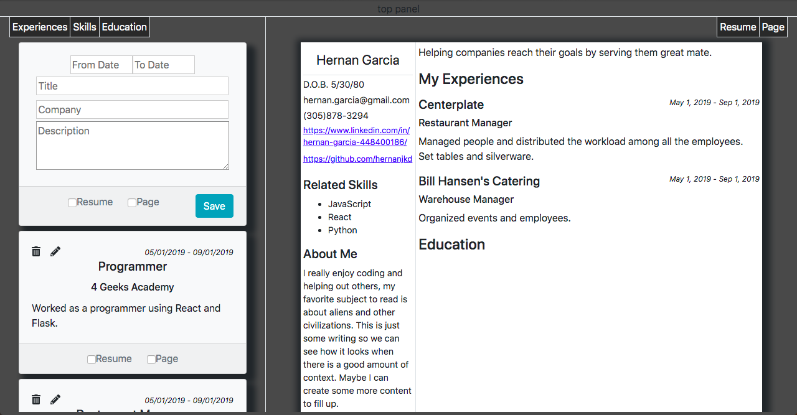

# Resume Builder

It generates a resume using information given by the user. The user has cards that can be added and modified with information regarding work experience, education and skills.

A more complete version of this app is used in the Professional Page project.

